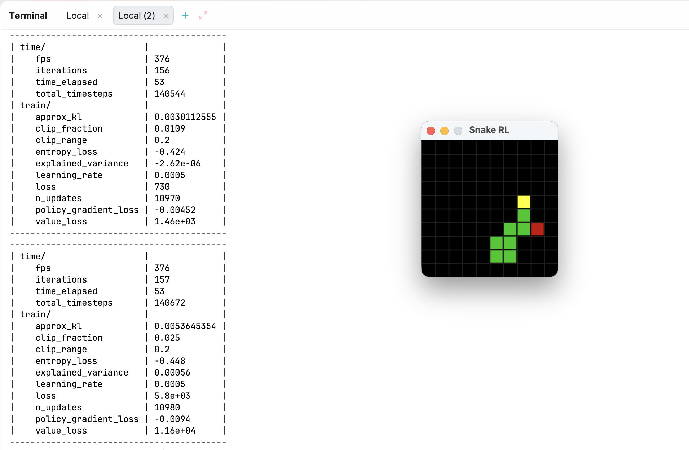
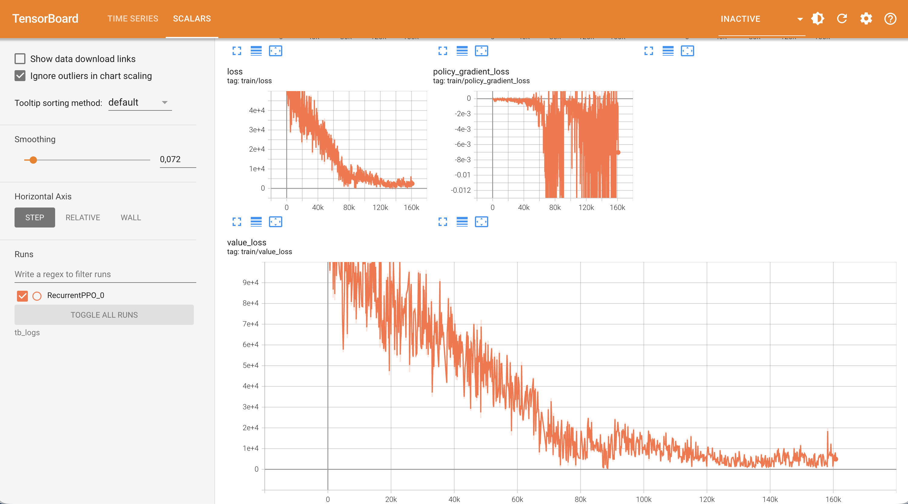

# Hello RL - Snake Game Training

[](https://www.python.org/)
[](https://gymnasium.farama.org/)
[](https://stable-baselines3.readthedocs.io/)
[](https://pyga.me/)
[](https://opensource.org/licenses/MIT)

A learning project for [reinforcement learning](https://en.wikipedia.org/wiki/Reinforcement_learning): train a recurrent
PPO agent to play Snake using [Gymnasium](https://gymnasium.farama.org/index.html).

Have a look at this list of [Resources for Reinforcement Learning](Reinforcement_Learning.md) if you want to learn more about the field.

The agent starts completely random and gradually learns to seek food and avoid walls. Training pauses periodically to
render episodes with Pygame so you can watch it improve in real time.



## Setup

```bash
uv sync
```

## Usage

```bash
uv run python train.py
```

### Arguments

| Flag                | Default      | Description                        |
|---------------------|--------------|------------------------------------|
| `--grid-size`       | 10           | Size of the NxN game grid          |
| `--total-timesteps` | 500000       | Total training steps               |
| `--render-every`    | 20000        | Steps between visualization pauses |
| `--render-episodes` | 3            | Episodes to render at each pause   |
| `--checkpoint-dir`  | checkpoints/ | Where to save models               |
| `--load-checkpoint` | None         | Resume from a saved model          |
| `--learning-rate`   | 3e-4         | PPO learning rate                  |
| `--n-steps`         | 128          | Steps per rollout                  |
| `--batch-size`      | 128          | PPO minibatch size                 |
| `--n-epochs`        | 10           | PPO update epochs                  |
| `--gamma`           | 0.99         | Discount factor                    |
| `--gae-lambda`      | 0.95         | GAE lambda                         |
| `--clip-range`      | 0.2          | PPO clip range                     |
| `--ent-coef`        | 0.01         | Entropy coefficient                |
| `--reward-food`     | 10.0         | Reward for eating food             |
| `--reward-crash`    | -100.0       | Penalty for hitting wall/self      |
| `--reward-step`     | -0.1         | Per-step penalty                   |

Check out [EXPERIMENTS.md](EXPERIMENTS.md) for ideas on how to play around with these parameters and see their effects.

## Monitoring with TensorBoard

Training metrics are logged automatically to `tb_logs/`. To view them, run TensorBoard in a separate terminal:

```bash
uv run tensorboard --logdir tb_logs
```

Then open <http://localhost:6006> in your browser. Available metrics:

| Metric                         | What it tells you                                                            |
|--------------------------------|------------------------------------------------------------------------------|
| `train/policy_gradient_loss`   | How much the policy is changing                                              |
| `train/value_loss`             | How well the critic predicts returns                                         |
| `train/entropy_loss`           | Exploration level (should decrease gradually, not collapse)                   |
| `train/approx_kl`             | Policy drift per update — spikes indicate instability                        |
| `train/clip_fraction`          | How often PPO clipping activates                                             |
| `train/explained_variance`     | Value function quality (0 = random, 1 = perfect)                             |
| `rollout/ep_rew_mean`          | Mean episode reward                                                          |
| `rollout/ep_len_mean`          | Mean episode length                                                          |
| `snake/score`                  | Food eaten per episode                                                       |


**Example of Board Metrics:**



## What the agent sees

The observation is a 15-dimensional feature vector:

| Features          | Dims | Range   | Description                                                                                     |
|-------------------|------|---------|-------------------------------------------------------------------------------------------------|
| Head position     | 2    | [0, 1]  | Row and column of the snake's head, normalized by grid size                                     |
| Food position     | 2    | [0, 1]  | Row and column of the food                                                                      |
| Direction to food | 2    | [-1, 1] | Relative vector from head to food                                                               |
| Danger flags      | 4    | {0, 1}  | Whether the immediate neighbor in each direction (up/down/left/right) is a wall or body segment |
| Current direction | 4    | one-hot | Which way the snake is currently facing                                                         |
| Snake length      | 1    | [0, 1]  | Body length normalized by total grid area                                                       |

The agent chooses from 4 discrete actions: up, down, left, right. Attempting a 180-degree turn (e.g. pressing left while
moving right) is ignored as the snake cannot walk on itself.
